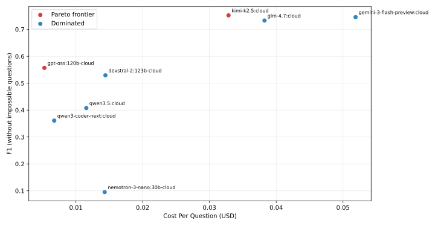
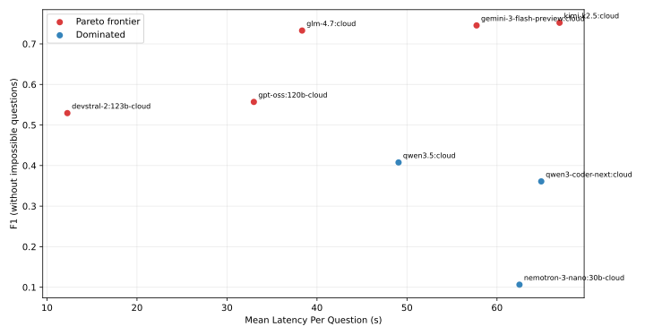

# Model Comparison Summary

## Table A: F1 by model and qtype

| model | direct_f1 | hop_f1 | query_builder_f1 | impossible_f1 | all_without_impossible_prf | all_with_impossible_prf |
| --- | --- | --- | --- | --- | --- | --- |
| devstral-2:123b-cloud | 0.895 | 0.511 | 0.236 | 0.267 | 0.887/0.536/0.529 | 0.764/0.628/0.477 |
| gemini-3-flash-preview:cloud | 0.877 | 0.587 | 0.769 | 0.233 | 0.789/0.845/0.745 | 0.678/0.876/0.644 |
| glm-4.7:cloud | 0.889 | 0.595 | 0.717 | 0.133 | 0.754/0.836/0.733 | 0.631/0.869/0.614 |
| gpt-oss:120b-cloud | 0.765 | 0.276 | 0.619 | 0.267 | 0.762/0.616/0.557 | 0.664/0.693/0.499 |
| kimi-k2.5:cloud | 0.907 | 0.670 | 0.691 | 0.133 | 0.753/0.833/0.752 | 0.630/0.866/0.629 |
| nemotron-3-nano:30b-cloud | 0.167 | 0.081 | 0.076 | 0.767 | 0.919/0.098/0.106 | 0.889/0.277/0.237 |
| qwen3-coder-next:cloud | 0.470 | 0.207 | 0.399 | 0.833 | 0.824/0.408/0.361 | 0.826/0.525/0.455 |
| qwen3.5:cloud | 0.591 | 0.233 | 0.400 | 0.500 | 0.949/0.413/0.408 | 0.859/0.530/0.426 |

## Table B: Explanation overhead (`cite+explain / total (share%)`)

| model | direct | hop | query_builder | impossible | all_without_impossible | all_with_impossible |
| --- | --- | --- | --- | --- | --- | --- |
| devstral-2:123b-cloud | 329k/932k (35.3%) | 721k/1.9m (37.3%) | 432k/1.2m (35.2%) | 317k/870k (36.5%) | 1.5m/4.1m (36.2%) | 1.8m/5.0m (36.3%) |
| gemini-3-flash-preview:cloud | 1.0m/2.8m (36.0%) | 1.3m/3.5m (37.5%) | 855k/2.4m (35.4%) | 987k/2.5m (38.9%) | 3.2m/8.7m (36.4%) | 4.2m/11.2m (37.0%) |
| glm-4.7:cloud | 516k/1.5m (34.7%) | 791k/2.3m (34.1%) | 1.1m/3.2m (34.9%) | 548k/1.8m (30.0%) | 2.4m/7.0m (34.6%) | 3.0m/8.9m (33.6%) |
| gpt-oss:120b-cloud | 623k/1.3m (48.5%) | 605k/1.8m (33.6%) | 1.6m/3.1m (49.9%) | 513k/1.3m (40.3%) | 2.8m/6.2m (44.9%) | 3.3m/7.5m (44.1%) |
| kimi-k2.5:cloud | 595k/1.1m (52.5%) | 1.2m/2.6m (46.7%) | 1.7m/3.1m (54.7%) | 783k/1.8m (44.7%) | 3.5m/6.8m (51.3%) | 4.3m/8.5m (50.0%) |
| nemotron-3-nano:30b-cloud | 6.2m/8.1m (76.9%) | 6.7m/9.3m (71.7%) | 9.0m/12.7m (71.1%) | 3.6m/4.8m (74.3%) | 21.9m/30.1m (72.9%) | 25.5m/34.9m (73.1%) |
| qwen3-coder-next:cloud | 930k/1.7m (53.2%) | 1.1m/1.9m (54.0%) | 911k/2.5m (36.0%) | 698k/1.4m (48.5%) | 2.9m/6.2m (46.5%) | 3.6m/7.7m (46.8%) |
| qwen3.5:cloud | 281k/946k (29.7%) | 165k/700k (23.5%) | 321k/1.3m (25.6%) | 202k/779k (26.0%) | 767k/2.9m (26.4%) | 969k/3.7m (26.3%) |

## Pareto Charts

## Notes

- Runtime token counts are inferred from `runtime_trace[*].usage`.
- If an event has multiple tool calls, event tokens are split evenly across those calls for explain-share.
- Pareto chart rendering requires matplotlib.
- Cost columns are estimated from `runtime_trace` input/output tokens and pricing file rates (`$/1M`).
- Pareto frontiers are computed per chart objective pair (cost-vs-F1 and latency-vs-F1), using dominance in those 2D spaces.
