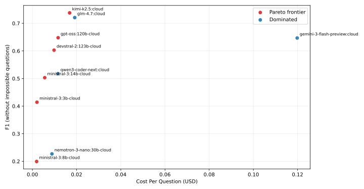
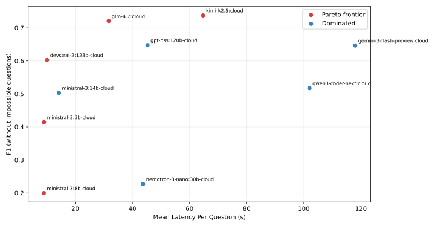

# Model Comparison Summary

## Table A: F1 by model and qtype

| model | direct_f1 | hop_f1 | query_builder_f1 | impossible_f1 | all_without_impossible_prf | all_with_impossible_prf |
| --- | --- | --- | --- | --- | --- | --- |
| devstral-2:123b-cloud | 0.863 | 0.601 | 0.384 | 0.633 | 0.934/0.605/0.603 | 0.874/0.684/0.609 |
| gemini-3-flash-preview:cloud | 0.574 | 0.662 | 0.696 | 0.367 | 0.712/0.844/0.647 | 0.643/0.875/0.591 |
| glm-4.7:cloud | 0.868 | 0.676 | 0.634 | 0.333 | 0.710/0.909/0.721 | 0.635/0.927/0.644 |
| gpt-oss:120b-cloud | 0.776 | 0.475 | 0.685 | 0.300 | 0.816/0.716/0.648 | 0.714/0.772/0.579 |
| kimi-k2.5:cloud | 0.929 | 0.693 | 0.614 | 0.300 | 0.722/0.870/0.738 | 0.638/0.896/0.651 |
| ministral-3:14b-cloud | 0.664 | 0.390 | 0.462 | 0.700 | 0.881/0.526/0.503 | 0.845/0.621/0.542 |
| ministral-3:3b-cloud | 0.731 | 0.355 | 0.196 | 0.300 | 0.856/0.442/0.414 | 0.745/0.553/0.391 |
| ministral-3:8b-cloud | 0.232 | 0.107 | 0.250 | 0.967 | 0.939/0.211/0.199 | 0.944/0.368/0.352 |
| nemotron-3-nano:30b-cloud | 0.300 | 0.203 | 0.185 | 0.733 | 0.898/0.223/0.227 | 0.866/0.378/0.328 |
| qwen3-coder-next:cloud | 0.525 | 0.344 | 0.659 | 0.700 | 0.804/0.620/0.518 | 0.784/0.696/0.554 |

## Table B: Explanation overhead (`cite+explain / total (share%)`)

| model | direct | hop | query_builder | impossible | all_without_impossible | all_with_impossible |
| --- | --- | --- | --- | --- | --- | --- |
| devstral-2:123b-cloud | 326k/859k (37.9%) | 348k/1.1m (31.5%) | 276k/857k (32.2%) | 175k/577k (30.3%) | 950k/2.8m (33.7%) | 1.1m/3.4m (33.1%) |
| gemini-3-flash-preview:cloud | 603k/1.2m (50.9%) | 2.0m/5.5m (35.3%) | 1.1m/3.2m (34.5%) | 3.7m/24.6m (15.0%) | 3.7m/9.9m (36.9%) | 7.4m/34.5m (21.3%) |
| glm-4.7:cloud | 387k/1.1m (35.2%) | 734k/2.0m (36.5%) | 1.2m/5.1m (23.7%) | 421k/1.8m (23.9%) | 2.3m/8.2m (28.4%) | 2.7m/9.9m (27.6%) |
| gpt-oss:120b-cloud | 612k/1.5m (39.9%) | 746k/2.3m (32.8%) | 1.1m/2.9m (38.1%) | 1.5m/3.8m (40.1%) | 2.5m/6.7m (36.7%) | 4.0m/10.5m (37.9%) |
| kimi-k2.5:cloud | 539k/1.0m (52.2%) | 736k/1.5m (49.8%) | 1.4m/2.6m (54.2%) | 804k/1.9m (42.7%) | 2.7m/5.1m (52.5%) | 3.5m/7.0m (49.9%) |
| ministral-3:14b-cloud | 507k/1.1m (46.7%) | 410k/1.2m (33.2%) | 425k/1.4m (31.2%) | 135k/521k (25.9%) | 1.3m/3.7m (36.4%) | 1.5m/4.2m (35.1%) |
| ministral-3:3b-cloud | 547k/1.0m (53.4%) | 365k/866k (42.2%) | 289k/598k (48.3%) | 283k/622k (45.5%) | 1.2m/2.5m (48.3%) | 1.5m/3.1m (47.7%) |
| ministral-3:8b-cloud | 117k/259k (45.3%) | 117k/371k (31.5%) | 465k/1.2m (37.8%) | 15k/63k (24.5%) | 699k/1.9m (37.6%) | 714k/1.9m (37.2%) |
| nemotron-3-nano:30b-cloud | 5.0m/6.5m (76.6%) | 4.1m/5.9m (69.8%) | 5.1m/8.4m (60.6%) | 3.1m/4.6m (68.3%) | 14.2m/20.9m (68.2%) | 17.4m/25.4m (68.2%) |
| qwen3-coder-next:cloud | 576k/1.2m (48.4%) | 1.1m/2.2m (50.6%) | 919k/2.7m (34.0%) | 538k/2.2m (24.3%) | 2.6m/6.1m (42.8%) | 3.2m/8.4m (37.9%) |

## Pareto Charts

## Notes

- Runtime token counts are inferred from `runtime_trace[*].usage`.
- If an event has multiple tool calls, event tokens are split evenly across those calls for explain-share.
- Pareto chart rendering requires matplotlib.
- Cost columns are estimated from `runtime_trace` input/output tokens and pricing file rates (`$/1M`).
- Pareto frontiers are computed per chart objective pair (cost-vs-F1 and latency-vs-F1), using dominance in those 2D spaces.
